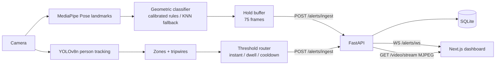

# Agentic Premier League: Real-Time Venue Security

Two computer-vision pipelines turn a camera feed into security alerts on a live operations dashboard:
**silent body-pose distress signals** from staff, and **crowd-density / dwell alerts** per venue zone.

## What it does
- **Distress signals (MediaPipe Pose):** staff hold one of 4 poses (medical emergency, theft, lost person,
  general alert). A geometric classifier scores 4 landmark features (wrist distance, wrist height,
  elbow spread, wrist-to-head proximity); thresholds are calibrated per operator with
  `pose_optimizer.py` (30-frame captures per pose). A KNN classifier is available as a fallback.
- **False-alarm control:** an alert fires only after the same pose is seen for 75 consecutive frames
  (≈5 s at 15 fps), then the buffer resets so one hold = one alert.
- **Crowd monitoring (YOLOv8n):** person tracking (Ultralytics tracker), polygon zones, tripwire
  entry/exit counts; instant over-capacity alerts, dwell alerts after 10 s over limit, 30 s per-zone cooldown.
- **Event bus:** FastAPI stores each alert (SQLite) and broadcasts it to dashboards over a WebSocket;
  camera frames are served as MJPEG.
- **Dashboard:** Next.js SOC view (`modern frontend/`): alert feed, zone heatmap, entry/exit counters,
  browser-tab alert state.

## Architecture


## Run locally
```bash
pip install -r requirements.txt
cd "modern frontend" && npm install && cd ..
cp .env.example .env
python run_platform.py                      # FastAPI :8000 + dashboard :3000
python cv_pipelines/gesture/alert_router.py # gesture pipeline (webcam 0)
python cv_pipelines/crowd/threshold_router.py  # crowd pipeline
```
Calibrate poses for a new operator: `python pose_optimizer.py` → `save <name>` per pose → `optimize`.
Model file: download `pose_landmarker_heavy.task` from Google's MediaPipe Pose Landmarker page into the repo root.

## Design decisions
| Decision | Why | Trade-off |
|---|---|---|
| Rule-based geometry over a trained classifier | 4 poses are geometrically distinct; works with ~30 calibration frames per pose | Operator- and camera-angle-specific; needs recalibration |
| Consecutive-frame hold | Filters transient poses (waving, stretching) | Counts frames, not seconds: hold time varies with real FPS |
| One HTTP ingest endpoint for both pipelines | Single audit trail; dashboards only subscribe to one socket | No auth yet (see Limitations) |
| SQLite | Zero-ops for a single-venue prototype | Not for multi-instance deployment |

## Limitations (honest status)
- **No labelled evaluation yet.** `verify_samples_headless.py` prints predictions for 4 sample images; it is not a test.
- Single camera; calibration for a single operator.
- `POST /alerts/ingest` is unauthenticated and CORS is open. Fine for localhost, not for the internet.
- `deploy/docker-compose.yml` is incomplete; the backend `Dockerfile` and `modern frontend/Dockerfile` are the working images.

## Roadmap (not yet done)
- Labelled clip set → precision / recall / false alarms per hold duration (1 s, 3 s, 5 s) → `eval/results.md`
- p50/p95 per-frame inference and camera-to-dashboard latency on named hardware
- pytest suite + GitHub Actions; timestamp-based hold window; auth on ingest

## License
MIT
